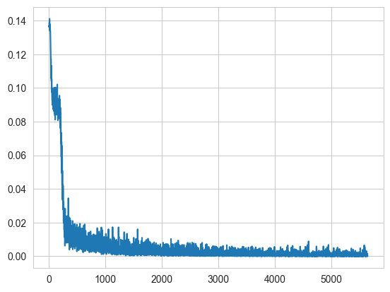
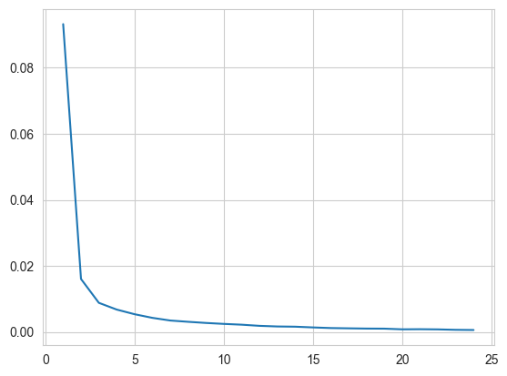

## MLP

This is a project implementing a Multilayer Perceptron with back propagation in numpy.

It supports the linear layer and several activation functions like sigmoid and softmax.

It also implements the SGD optimizer. 

There is a sample of the network training on MNIST ml.dataset in the file.

Loss by iteration:

Loss by epoch:

